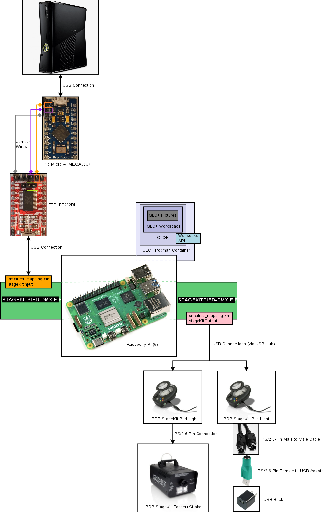
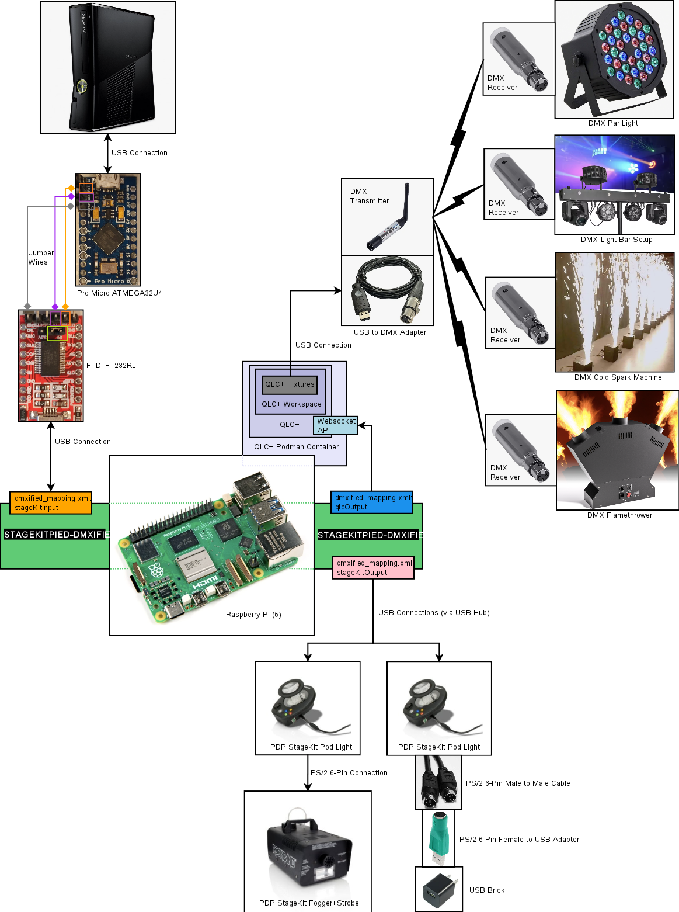
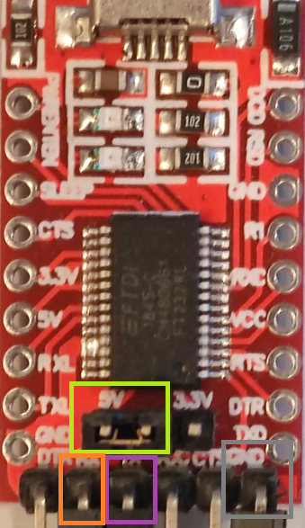

# StageKitPied-DMXified

_**StageKitPied-DMXified**_ is a highly configurable interface that runs on the Raspberry Pi platform.  It sits between
an Xbox 360 and the Rock Band StageKit (released by PDP) to read the lighting cues from the Harmonix games "Rock Band 2"
and "Rock Band 3", which it then uses to:
* repeat those lighting cues to up to four (4) Rock Band StageKit Light Pods
* switch on & off LEDs in a large LED strip array
* configure arbitrary lighting cues to **_any_** DMX devices (lighting & lasers, cold sparks, flames, etc etc etc) via a
QLC+ workspace

Separately, this software can send arbitrary lighting cues to DMX devices based on the presence or absence of a file on
the Raspberry Pi file system, and includes scripts for creating/deleting files based on buttons connected to the
Raspberry Pi. This is immediately useful when configuring these scripts with, say, a pedalboard/stompbox (pushing a
button creates a file on the Raspberry Pi, whose presence is in turn configured to put DMX devices in "Sound Mode",
black light mode, or whatever you choose via QLC+).  The included scripts can handle:
* hold-release buttons
* toggle button press (a button that acts as a switch)
* toggle button for running arbitrary commands (for example, starting and stopping _**StageKitPied-DMXified**_)

No PDP StageKit/Serial Adapter?  Well that's not a problem if you're using RB3Enhanced
(https://github.com/RBEnhanced/RB3Enhanced).  To be able to use the RB3Enhanced data, please read the RB3Enhanced
section in this README.  Thanks go out to the RB3Enhanced devs for highlighting the relevant data they can send out over
UDP.

## Examples of it in Action

### Multiple Stage Kit Light Pods:

TODO: insert video[s] links here for multiple PDP StageKit Pods running with _**StageKitPied-DMXified**_

### LED Strip Array Examples:

[](https://www.youtube.com/watch?v=fq0_RiIjsV8)

[](https://www.youtube.com/watch?v=q-61C9YkRUw)

### DMX Devices:

TODO: insert video[s] links here for DMX devices running with _**StageKitPied-DMXified**_

### Button-Triggered Effects (using file-monitoring capabilities):

TODO: insert video[s] links here for button-box triggering effects

# WARNING

**You attempt any of this at your own risk.  Incorrectly wiring and powering electronics can result in fires or even
worse.**

**You have been warned!**

# Build the System

Below are some diagrams representing various setups possible with _**StageKitPied-DMXified**_, from simple to more robust. 

## Simple Architecture for Rock Band StageKit Light Pod[s]



## DMXified Architecture for Rock Band StageKit Light Pod[s] + DMX Device[s]



## Button-Controlled DMXified Architecture for Rock Band StageKit Light Pod[s] + DMX Devices[s] + Button Box


## Hardware Summary

### Base Requirement:

* Raspberry Pi - Version 1 should be enough, default Raspbian OS, but it's been tested using Version 5.

### Standard Configuration

_(not required if using [RBEnhanced](https://github.com/RBEnhanced/RB3Enhanced))_
* Serial Adapter (see below)
* Rock Band Stage Kit - Released by PDP.  Just the light POD on its own will do.

### LED Strip Arrays:

_(optional add-on)_
* SK9822 LEDs - I'm using 60 per M but any configuration should be ok.
* PSU - The SK9822 LEDs are 0.06amp per segment (each segment has 3 leds @ 0.02amp). So 70 segments is 70 x 0.06 =
4.2amp.

### DMX Lighting Equipment:

_(optional, but this is where things get fun--here, we put the DMXified in **StageKitPied-DMXified**)_
* A DMX output adapter for the Raspberry Pi (typically USB).  Not endorsing, but I use
[this Jhoinrch FT232RNL-based adapter](https://www.amazon.com/dp/B0D5YN6PMG).
* **_ANY_** DMX device[s]

### External Buttons

_(optional, if using the file-based triggers)_
* Any GPIO-connected button for the Raspberry Pi

## Building the Serial Adapter

### Hardware

**Left**: Serial Adapter = FTDI-FT232RL, **Right**: Pro Micro = ATMEGA32U4 5V 16MHz.

  

If selectable voltage, then ensure the jumper is set to 5V (Green box in pic)

### Connection

- Connect the Serial Adapter GROUND to Pro Micro GROUND (Grey box in pics)
- Connect the Serial Adapter TX to Pro Micro RX1 (Purple box in pics)
- Connect the Serial Adapter RX to Pro Micro TX0 (Orange box in pics)

### Installing the Firmware

#### Install GIMX

Thankfully GIMX 8.0 makes this bit super easy. :)

Get it from here: https://github.com/matlo/GIMX/releases/tag/v8.0

In the installation directory firmware directory:
> Windows Default = "C:\Program Files\GIMX\firmware"

Either compile the firmware yourself, or use the compiled firmware file `gimx-adapter/atmega32u4.hex`.

- Connect the Serial Adapter (FTDI-FT232RL) to the PC via USB.
- Open GIMX
- Click `"Help"` -> `"Update Firmware"`
- Select `"atmega32u4.hex"` then click `"Load"`
- Follow the instructions to load the firmware onto the Pro Micro.

_**Note:** I had trouble with this step while building my Serial Adapter.  Ultimately, I resorted to using the following
[avrdude](https://github.com/avrdudes/avrdude) command (the "COM5" value for where the serial adapter is, might need to change for your setup)_:
```
#> avrdude.exe -p atmega32u4 -c avr109 -P COM5 -D -U flash:w:firmware/atmega32u4.hex -C avrdude.conf
```

### Building LED Strip Arrays (Optional)

**Ensure you use the correct fuse ratings on the LED strips!**

Multiple strips can be joined together using the data & clock channels, then feed each strip with it's own power.

Example, I use 4 strips.  Each strip has it's own fuse and PSU connection.
 - 2 strips x 70 segments = 2 x 4.2amp = 5 amp fuses.
 - 2 strips x 40 segments = 2 x 2.4amp = 3 amp fuses.
 
**Ensure you use correct AWG rated wire for your power requirements.**

Connect the SK9822...
 - GND : Ensure it's to the Ground on the PSU, the Raspberry Pi should also use the same ground.
 - C(lock) : SPI SCLK (GPIO 11) on the Raspberry Pi.
 - D(ata) : SPI MOSI (GPIO 10) on the Raspberry Pi.
 - 5V : Positive output on PSU.

# Setting up the Stage Kit Pied - DMXified Software

## Installing the Software

* **For 32-bit OS only:** You can use the included, compiled `StageKitPied/skp` program as well as the `*.ini` files and
[StageKitPied/dmxified_mapping.xml](StageKitPied/dmxified_mapping.xml) configuration file.  Thus, you can skip the
compilation step.
* **Or/Otherwise:** Please compile from the source on your Raspberry Pi using the following command in the
[StageKitPied](StageKitPied) directory:
> #> make

Then, run the following command from within the [installer](installer) directory:
```
#> ./install_skp_service.sh
Usage: sudo ./install_skp_service [SKP lights.ini File] [Mapping Config File] [QLC+ Workspace File] [QLC+ Fixtures Directory]
```
which as shown above will show you a Usage printout.

Here's an explanation of the arguments:
* **[SKP lights.ini File]** - the main configuration file for the software, which handles configuration of
_**StageKitPied-DMXified**_, PDP StageKit[s] with DMX devices, LED Strip Arrays (optionally with RB3Enhanced).
* **[Mapping Config File]** - if using DMX devices or buttons, this is the configuration file for them.
* **[QLC+ Workspace File]** - if using DMX, this is the QLC+ workspace whose Widgets are referenced by the Mapping
Config File.
* **[QLC+ Fixtures Directory]** - if using DMX, this is the directory where your QLC+ Fixture files are stored.

The values I used are:
```
#> sudo ./install_skp_service.sh ../StageKitPied/lights.ini ../StageKitPied/dmxified_mapping.xml qlc/qlcplusSkpDmx.qxw qlc/fixtures
```

**_Note_**: _The installer must be run as root because it installs system services that must be run as root, most
notably **StageKitPied-DMXified**._

## Edit the lights.ini File

This is the main configuration file, and used to configure multiple devices/configuration scenarios.  Ultimately, all
the different lighting setups (PDP StageKit[s], RB3Enhanced, LED Strip Arrays, DMX devices/buttons) begin here for
configuration.  The [StageKitPied/lights.ini](StageKitPied/lights.ini) file is heavily commented itself, so one should
be able to figure it out from there, but we can go over some that are commonly changed from the defaults here.

In the `[STAGEKIT_CONFIG]` section, you can enable pass-through to the PDP StageKit for the following items:
- Xbox 360 LED Status
- PDP StageKit Pod lights
- PDP StageKit Fog
- PDP StageKit Strobe

If you want the PDP StageKit Pod to go dark, set those to 0 and then there's no needs to have the Fog/Strobe unit out.

In the `[LEDS]` section (if using an LED Strip Array):
 - Enter the amount of LEDs you have in the `LED_AMOUNT=xxx`
 - Enter the `INI_DEFAULT=x` for the LED settings INI file you want.  Included is 5 examples (`ledsX.ini`).

In the `[DMXIFIED]` section (if using DMX devices):
- Enter the location of the mapping file if different from the one provided during install.

There's other settings, but the other defaults should be ok for most.

## Edit the leds(x).ini

If using an LED Strip Array, you may find these files in `/opt/StageKitPied`:

`[SK_COLOURS]`
 - Stores the basic led colour values for RED, GREEN, BLUE, YELLOW & STROBE.

`[RED_GROUP_X]` `[GREEN_GROUP_X]` `[BLUE_GROUP_X]` `[YELLOW_GROUP_X]`
There are 8 sections for each of these, where `X` corresponds to the 8 colour LEDs on the actual PDP StageKit POD.
 - `BRIGHTNESS=xx` : How bright do want these?  Values are 0 (off) to 15 (max)
 - `AMOUNT=xx` : The amount of LEDs that are in this grouping.
 - `LEDS=xx,xx,xx` : Comma separated LED numbers that are in this group.

`[STROBE]`
 - `BRIGHTNESS=xx` : How bright do want the strobe?  Values are 0 (off) to 15 (max)
 - `LEDS_ALL=0` : Set this to 1 for the strobe to use every LED.
 - `LEDS_AUTO=0` : Set this to 1 and the program will work out which LEDs are not assigned to the colours and use them
for strobe.
 - `AMOUNT=xx` : If manually setting the LEDs to use as strobe, enter how many there are.
 - `LEDS=xx,xx` : Comma-separated LED numbers that are to be used for the strobe.

## Edit the DMXifed Mapping File

If using DMX devices, you may find this file installed into `/opt/StageKitPied/dmxified_mapping.xml`:

This file is documented further in [StageKitPied/dmxified/README.md](StageKitPied/dmxified/README.md).

## RB3Enhanced

To run with RB3Enhanced, then a PDP StageKit and the Serial Adapter are not required.  This setup is untested with DMX
devices.

Create the LED Strip Array as mentioned above.

Edit the [StageKitPied/lights.ini](StageKitPied/lights.ini) to enable `RB3E` mode:

`[RB3E]`
- `ENABLED=1`: Set this to 1 to make the program listen for the RB3Enhanced data stream.
- `SOURCE_IP=0.0.0.0`: Leave this as 0.0.0.0 to listen out for any IP on your network, or set it to the IP of the
Xbox 360.
- `LISTENING_PORT=21070`: Default port that RB3Enhanced will send to.

Edit the RB3Enhanced `rb3.ini` section (_**Note:** this file is part of RB3Enhanced, not **StageKitPied-DMXified**_):

`[Events]`
- `EnableEvents = true`: Set this to true for events to be sent over the network.
- `BroadcastTarget = 255.255.255.255`: This is broadcast to all IP on your network.  If you know your Raspberry Pi IP,
then you can set this here.

_**Note:** If running using RB3Enhanced, root is not required since the program does not need to access USB for the PDP
StageKit Pod[s] or the Serial Adapter.  Thus, as an alternative to running **StageKitPied-DMXified** program as a system
service, you could run it as a standalone program.  To do so, ensure that all the **StageKitPied-DMXified** INI files
are in the same folder as the `skp` program and then simply run it as follows:_

> ./skp

# Physically Connecting Everything

- Connect the Pro Micro USB side to the Xbox 360.
- Connect the Serial Adapter USB side to the Raspberry Pi.
- Connect the PDP StageKit Pod to the Raspberry Pi.
- Connect the DMX Output Adapter to the Raspberry Pi.
- Run the Stage Kit Pied - DMXified program with the command
  >sudo systemctl start stagekitpied
 
_**Note:** root is required to access the USB PDP StageKit device, so sudo is used for starting the stagekitpied
service._

# Notes

The PDP StageKit Pod will not show LEDs unless it has power via the PS/2 port by either:
- Using the Fog/Strobe unit per original boxing.
- A PS/2 to USB cable connected to a minimum 1amp power source (I have one of these
[PS/2 to USB adapters](https://www.amazon.com/dp/B0D6QLMVF7) and [this cable](https://www.amazon.com/dp/B005J1LEZK)
plugged into a USB power brick).

The _**StageKitPied-DMXified**_ program needs root access to be able to use the USB ports.

The light show does not work in Rock Band Practice Mode.

The reason for all the different led INI files was due to an earlier version that allowed switching on the fly, which
probably won't be added back.

# Known Issues

The _**StageKitPied-DMXified**_ program will generate warnings from the Serial Adapter, these can be suppressed in the
[StageKitPied/lights.ini](StageKitPied/lights.ini).

The _**StageKitPied-DMXified**_ program will generate warnings from the USB connection, these are very infrequent and
can be ignored.
